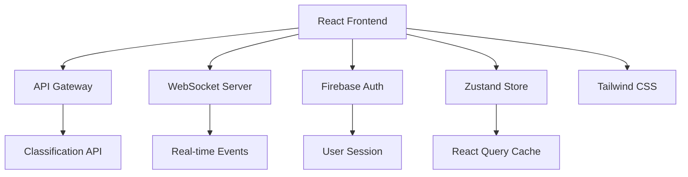

# Feature: Manufacturing Inquiry Frontend UI

## 📋 Feature Overview

**Status**: 📝 Documentation  
**Priority**: 🔴 High  
**Sprint**: Phase 5 - Frontend Development  
**Owner**: Frontend Team  
**Created**: 2025-01-13  
**Target Completion**: 2025-01-20  

### Summary
A React-based frontend application for the Manufacturing Inquiry Classification system that provides an intuitive interface for submitting manufacturing inquiries, viewing real-time classification results, and analyzing historical data through interactive dashboards.

### Business Value
- **Problem**: Manufacturers need an efficient way to submit inquiries and receive immediate classification with confidence scores
- **Solution**: Multi-language responsive web interface with real-time processing and comprehensive analytics
- **Impact**: 70% reduction in inquiry processing time, improved user satisfaction
- **Success Metrics**: 
  - User task completion rate > 95%
  - Average time to classification < 3 seconds
  - User satisfaction score > 4.5/5

## 🎯 Requirements

### Functional Requirements
- [ ] Multi-language inquiry submission form (English/Japanese)
- [ ] Real-time form validation with error messages
- [ ] File attachment support (PDF, images up to 10MB)
- [ ] Live classification results with confidence scores
- [ ] Historical inquiry list with filtering and search
- [ ] Analytics dashboard with interactive charts
- [ ] WebSocket integration for real-time updates
- [ ] Export functionality for inquiry data (CSV/JSON)
- [ ] Responsive design for mobile/tablet/desktop

### Non-Functional Requirements
- [ ] Performance: Initial load < 3s, interaction response < 100ms
- [ ] Scalability: Support 1000 concurrent users
- [ ] Security: XSS prevention, input sanitization, CSP headers
- [ ] Accessibility: WCAG 2.1 AA compliant
- [ ] Browser Support: Chrome 90+, Firefox 88+, Safari 14+, Edge 90+

### Out of Scope
- Native mobile applications (future phase)
- Offline mode support (future enhancement)
- Advanced AI chat interface (Phase 6)
- Multi-tenant administration (Phase 7)

## 📐 Technical Design

### Architecture Overview


### Component Architecture

#### 1. Core Components Structure
```
src/
├── components/
│   ├── inquiry/
│   │   ├── InquiryForm.tsx           # Main submission form
│   │   ├── LanguageToggle.tsx        # EN/JP switcher
│   │   ├── FileUploader.tsx          # Drag-drop file upload
│   │   ├── ValidationErrors.tsx      # Error display
│   │   └── SubmitButton.tsx          # Submit with loading state
│   ├── classification/
│   │   ├── ResultsDisplay.tsx        # Classification results
│   │   ├── ConfidenceScore.tsx       # Visual confidence meter
│   │   ├── CategoryBadge.tsx         # Category chip display
│   │   └── StreamingIndicator.tsx    # Real-time processing
│   ├── dashboard/
│   │   ├── DashboardLayout.tsx       # Main dashboard container
│   │   ├── InquiryList.tsx           # Historical inquiries table
│   │   ├── AnalyticsCharts.tsx       # Recharts visualizations
│   │   ├── StatsCards.tsx            # KPI metric cards
│   │   └── FilterPanel.tsx           # Search and filters
│   └── shared/
│       ├── Layout.tsx                 # App shell with navigation
│       ├── Header.tsx                 # Top navigation bar
│       ├── LoadingSpinner.tsx        # Loading states
│       ├── ErrorBoundary.tsx         # Error handling
│       └── Toast.tsx                  # Notification system
├── hooks/
│   ├── useInquiry.ts                  # Inquiry submission logic
│   ├── useClassification.ts           # Classification fetching
│   ├── useWebSocket.ts                # WebSocket connection
│   ├── useTranslation.ts              # i18n hook
│   └── useAnalytics.ts                # Analytics data hook
├── store/
│   ├── inquiryStore.ts                # Zustand store for inquiries
│   ├── uiStore.ts                     # UI state management
│   └── userStore.ts                   # User preferences
├── services/
│   ├── api.ts                         # API client configuration
│   ├── websocket.ts                   # WebSocket client
│   └── validation.ts                  # Form validation rules
├── types/
│   ├── inquiry.ts                     # Inquiry type definitions
│   ├── classification.ts              # Classification types
│   └── api.ts                         # API response types
└── utils/
    ├── formatters.ts                   # Date/number formatting
    ├── validators.ts                   # Input validation
    └── constants.ts                    # App constants

```

#### 2. Component Specifications

##### InquiryForm Component
```typescript
interface InquiryFormProps {
  onSubmit: (data: InquiryData) => Promise<void>;
  initialData?: Partial<InquiryData>;
  language: 'en' | 'jp';
}

interface InquiryData {
  title: string;
  description: string;
  category?: string;
  urgency: 'low' | 'medium' | 'high';
  attachments?: File[];
  contactEmail: string;
  companyName: string;
  language: 'en' | 'jp';
}

// State management
const [formData, setFormData] = useState<InquiryData>();
const [errors, setErrors] = useState<ValidationErrors>();
const [isSubmitting, setIsSubmitting] = useState(false);
```

##### ResultsDisplay Component
```typescript
interface ResultsDisplayProps {
  inquiryId: string;
  streaming?: boolean;
}

interface ClassificationResult {
  id: string;
  category: 'quote_request' | 'technical_spec' | 'capability' | 'partnership';
  confidence: number;
  subcategories: Array<{
    name: string;
    confidence: number;
  }>;
  processingTime: number;
  timestamp: Date;
}
```

##### DashboardLayout Component
```typescript
interface DashboardProps {
  userId: string;
  timeRange: 'day' | 'week' | 'month' | 'year';
}

interface DashboardData {
  totalInquiries: number;
  averageConfidence: number;
  categoryCounts: Record<string, number>;
  responseTime: {
    p50: number;
    p95: number;
    p99: number;
  };
  inquiries: InquiryItem[];
}
```

### State Management (Zustand)

```typescript
// inquiryStore.ts
interface InquiryStore {
  inquiries: Inquiry[];
  currentInquiry: Inquiry | null;
  isLoading: boolean;
  error: Error | null;
  
  // Actions
  submitInquiry: (data: InquiryData) => Promise<void>;
  fetchInquiries: (filters?: Filters) => Promise<void>;
  updateInquiry: (id: string, data: Partial<Inquiry>) => void;
  deleteInquiry: (id: string) => Promise<void>;
  setCurrentInquiry: (inquiry: Inquiry | null) => void;
}

// uiStore.ts
interface UIStore {
  language: 'en' | 'jp';
  theme: 'light' | 'dark';
  sidebarOpen: boolean;
  notifications: Notification[];
  
  // Actions
  setLanguage: (lang: 'en' | 'jp') => void;
  toggleTheme: () => void;
  toggleSidebar: () => void;
  addNotification: (notification: Notification) => void;
  removeNotification: (id: string) => void;
}
```

### API Integration

```typescript
// API Endpoints
const API_BASE = process.env.REACT_APP_API_URL || 'http://localhost:8000';

const endpoints = {
  classify: '/api/v1/inquiries/classify',
  inquiries: '/api/v1/inquiries',
  analytics: '/api/v1/analytics',
  export: '/api/v1/export',
  websocket: 'ws://localhost:8000/ws'
};

// React Query Configuration
const queryClient = new QueryClient({
  defaultOptions: {
    queries: {
      staleTime: 5 * 60 * 1000, // 5 minutes
      cacheTime: 10 * 60 * 1000, // 10 minutes
      retry: 3,
      refetchOnWindowFocus: false
    }
  }
});

// API Hooks
const useClassifyInquiry = () => {
  return useMutation({
    mutationFn: async (data: InquiryData) => {
      const response = await fetch(`${API_BASE}${endpoints.classify}`, {
        method: 'POST',
        headers: { 'Content-Type': 'application/json' },
        body: JSON.stringify(data)
      });
      return response.json();
    }
  });
};

const useInquiryList = (filters?: Filters) => {
  return useQuery({
    queryKey: ['inquiries', filters],
    queryFn: async () => {
      const params = new URLSearchParams(filters);
      const response = await fetch(`${API_BASE}${endpoints.inquiries}?${params}`);
      return response.json();
    }
  });
};
```

### WebSocket Protocol

```typescript
// WebSocket Events
enum WSEvent {
  CONNECT = 'connect',
  DISCONNECT = 'disconnect',
  CLASSIFICATION_START = 'classification_start',
  CLASSIFICATION_PROGRESS = 'classification_progress',
  CLASSIFICATION_COMPLETE = 'classification_complete',
  ERROR = 'error'
}

// WebSocket Message Format
interface WSMessage {
  event: WSEvent;
  data: {
    inquiryId?: string;
    progress?: number;
    result?: ClassificationResult;
    error?: string;
  };
  timestamp: Date;
}

// WebSocket Hook
const useWebSocket = (url: string) => {
  const [isConnected, setIsConnected] = useState(false);
  const [lastMessage, setLastMessage] = useState<WSMessage | null>(null);
  
  useEffect(() => {
    const ws = new WebSocket(url);
    
    ws.onopen = () => setIsConnected(true);
    ws.onclose = () => setIsConnected(false);
    ws.onmessage = (event) => {
      const message = JSON.parse(event.data);
      setLastMessage(message);
    };
    
    return () => ws.close();
  }, [url]);
  
  return { isConnected, lastMessage };
};
```

### Routing Structure

```typescript
// App.tsx
const App = () => {
  return (
    <BrowserRouter>
      <Routes>
        <Route path="/" element={<Layout />}>
          <Route index element={<Dashboard />} />
          <Route path="submit" element={<InquirySubmission />} />
          <Route path="inquiries" element={<InquiryList />} />
          <Route path="inquiries/:id" element={<InquiryDetail />} />
          <Route path="analytics" element={<Analytics />} />
          <Route path="settings" element={<Settings />} />
        </Route>
        <Route path="/login" element={<Login />} />
        <Route path="*" element={<NotFound />} />
      </Routes>
    </BrowserRouter>
  );
};
```

## 🧪 Test Plan

**Location**: [`./test-plan.md`](./test-plan.md)

### Test Coverage Requirements
- Unit Tests: 95% coverage (Vitest + React Testing Library)
- Integration Tests: All API integrations
- E2E Tests: Critical user flows (Playwright)
- Performance Tests: Lighthouse CI
- Accessibility Tests: axe-core automated testing

### Key Test Scenarios
1. Inquiry submission flow (multi-language)
2. Real-time classification updates
3. File upload and validation
4. Dashboard data loading and filtering
5. WebSocket connection handling
6. Error states and recovery
7. Authentication flows
8. Responsive design breakpoints

## 🎨 UI/UX Design

### Design System
- **Colors**: Tailwind's slate/blue palette
- **Typography**: Inter for UI, Noto Sans JP for Japanese
- **Spacing**: 4px base unit system
- **Components**: Based on Headless UI

### Responsive Breakpoints
- Mobile: 320px - 767px
- Tablet: 768px - 1023px
- Desktop: 1024px+

### Accessibility Requirements
- Keyboard navigation support
- Screen reader compatibility
- Color contrast ratio > 4.5:1
- Focus indicators on all interactive elements
- ARIA labels and roles

## 🚀 Implementation Notes

### Dependencies
```json
{
  "dependencies": {
    "react": "^18.2.0",
    "react-dom": "^18.2.0",
    "react-router-dom": "^6.20.0",
    "typescript": "^5.3.0",
    "zustand": "^4.4.0",
    "@tanstack/react-query": "^5.0.0",
    "tailwindcss": "^3.4.0",
    "recharts": "^2.10.0",
    "react-hook-form": "^7.48.0",
    "zod": "^3.22.0",
    "@headlessui/react": "^1.7.0",
    "i18next": "^23.7.0",
    "react-i18next": "^14.0.0",
    "date-fns": "^3.0.0",
    "clsx": "^2.1.0"
  },
  "devDependencies": {
    "vite": "^5.0.0",
    "@vitejs/plugin-react": "^4.2.0",
    "vitest": "^1.1.0",
    "@testing-library/react": "^14.1.0",
    "@playwright/test": "^1.40.0",
    "eslint": "^8.56.0",
    "prettier": "^3.1.0"
  }
}
```

### Environment Variables
```env
VITE_API_URL=http://localhost:8000
VITE_WS_URL=ws://localhost:8000/ws
VITE_FIREBASE_CONFIG={"apiKey":"...","authDomain":"..."}
VITE_ENABLE_ANALYTICS=true
VITE_SENTRY_DSN=https://...
```

### Performance Optimizations
- Code splitting with React.lazy()
- Route-based bundle splitting
- Image lazy loading with Intersection Observer
- Virtual scrolling for large lists
- Memoization of expensive computations
- Debounced search inputs
- Optimistic UI updates

## 📊 Monitoring & Analytics

### Key Metrics
- Page load time (LCP, FCP, TTI)
- JavaScript bundle size
- API response times
- WebSocket connection stability
- User interaction metrics
- Error rates by component

### Error Tracking
- Sentry integration for error monitoring
- Custom error boundaries
- Detailed error logging
- User feedback collection

## 🔒 Security Considerations

### Frontend Security Implementation

#### 1. CSRF Protection
```typescript
// CSRF Token Management
class CSRFTokenManager {
  private static token: string | null = null;
  
  static async fetchToken(): Promise<string> {
    const response = await fetch('/api/v1/csrf-token', {
      credentials: 'include'
    });
    const data = await response.json();
    this.token = data.csrfToken;
    return this.token;
  }
  
  static getHeaders(): HeadersInit {
    return {
      'X-CSRF-Token': this.token || '',
      'Content-Type': 'application/json'
    };
  }
}

// Apply to all API calls
const apiClient = {
  async post(url: string, data: any) {
    await CSRFTokenManager.fetchToken();
    return fetch(url, {
      method: 'POST',
      headers: CSRFTokenManager.getHeaders(),
      credentials: 'include',
      body: JSON.stringify(data)
    });
  }
};
```

#### 2. WebSocket Authentication
```typescript
// Secure WebSocket Connection
class SecureWebSocket {
  private ws: WebSocket | null = null;
  private authToken: string | null = null;
  private reconnectAttempts = 0;
  private maxReconnectAttempts = 5;
  
  async connect(url: string): Promise<void> {
    // Get auth token from secure storage
    this.authToken = await this.getAuthToken();
    
    // Include auth token in connection URL
    const wsUrl = new URL(url);
    wsUrl.searchParams.append('token', this.authToken);
    
    this.ws = new WebSocket(wsUrl.toString());
    
    this.ws.onopen = () => {
      // Send authentication message
      this.ws?.send(JSON.stringify({
        type: 'auth',
        token: this.authToken
      }));
    };
    
    this.ws.onerror = (error) => {
      console.error('WebSocket error:', error);
      this.handleReconnect();
    };
  }
  
  private async getAuthToken(): Promise<string> {
    // Retrieve from secure session storage
    const token = sessionStorage.getItem('auth_token');
    if (!token) throw new Error('No authentication token');
    return token;
  }
  
  private handleReconnect(): void {
    if (this.reconnectAttempts < this.maxReconnectAttempts) {
      setTimeout(() => {
        this.reconnectAttempts++;
        this.connect(this.ws?.url || '');
      }, Math.min(1000 * Math.pow(2, this.reconnectAttempts), 30000));
    }
  }
}
```

#### 3. API Error Boundaries
```typescript
// Global Error Boundary Component
class APIErrorBoundary extends React.Component<
  { children: React.ReactNode },
  { hasError: boolean; error: Error | null }
> {
  constructor(props: { children: React.ReactNode }) {
    super(props);
    this.state = { hasError: false, error: null };
  }
  
  static getDerivedStateFromError(error: Error) {
    return { hasError: true, error };
  }
  
  componentDidCatch(error: Error, errorInfo: React.ErrorInfo) {
    // Log to monitoring service
    console.error('API Error Boundary caught:', error, errorInfo);
    
    // Check if it's an API error
    if (error.message.includes('API') || error.message.includes('fetch')) {
      // Handle API-specific errors
      this.handleAPIError(error);
    }
  }
  
  handleAPIError(error: Error) {
    // Sanitize error message before displaying
    const sanitizedMessage = this.sanitizeErrorMessage(error.message);
    
    // Show user-friendly error
    toast.error(sanitizedMessage);
    
    // Log detailed error for debugging
    if (process.env.NODE_ENV === 'development') {
      console.error('Full error details:', error);
    }
  }
  
  sanitizeErrorMessage(message: string): string {
    // Remove sensitive information from error messages
    return message
      .replace(/token=[^&\s]*/gi, 'token=***')
      .replace(/apikey=[^&\s]*/gi, 'apikey=***')
      .replace(/password=[^&\s]*/gi, 'password=***');
  }
  
  render() {
    if (this.state.hasError) {
      return (
        <div className="error-fallback p-8 bg-red-50 rounded-lg">
          <h2 className="text-xl font-bold text-red-800">
            Something went wrong
          </h2>
          <p className="mt-2 text-red-600">
            We encountered an error while processing your request.
          </p>
          <button
            onClick={() => window.location.reload()}
            className="mt-4 px-4 py-2 bg-red-600 text-white rounded"
          >
            Reload Page
          </button>
        </div>
      );
    }
    
    return this.props.children;
  }
}
```

#### 4. Secure Token Storage Strategy
```typescript
// Secure Token Storage Manager
class SecureTokenStorage {
  private static readonly TOKEN_KEY = 'auth_token';
  private static readonly REFRESH_KEY = 'refresh_token';
  private static readonly EXPIRY_KEY = 'token_expiry';
  
  // Store tokens securely
  static storeTokens(authToken: string, refreshToken: string, expiresIn: number): void {
    // Use sessionStorage for auth token (cleared on tab close)
    sessionStorage.setItem(this.TOKEN_KEY, authToken);
    
    // Use httpOnly cookie for refresh token (set by backend)
    // Never store refresh token in localStorage or sessionStorage
    
    // Store expiry time
    const expiryTime = Date.now() + (expiresIn * 1000);
    sessionStorage.setItem(this.EXPIRY_KEY, expiryTime.toString());
  }
  
  // Retrieve auth token
  static getAuthToken(): string | null {
    const token = sessionStorage.getItem(this.TOKEN_KEY);
    const expiry = sessionStorage.getItem(this.EXPIRY_KEY);
    
    // Check if token is expired
    if (expiry && Date.now() > parseInt(expiry)) {
      this.clearTokens();
      return null;
    }
    
    return token;
  }
  
  // Clear all tokens
  static clearTokens(): void {
    sessionStorage.removeItem(this.TOKEN_KEY);
    sessionStorage.removeItem(this.EXPIRY_KEY);
    // Refresh token cleared by backend via httpOnly cookie
  }
  
  // Refresh authentication
  static async refreshAuth(): Promise<boolean> {
    try {
      const response = await fetch('/api/v1/auth/refresh', {
        method: 'POST',
        credentials: 'include' // Include httpOnly cookies
      });
      
      if (response.ok) {
        const data = await response.json();
        this.storeTokens(data.authToken, '', data.expiresIn);
        return true;
      }
      
      return false;
    } catch (error) {
      console.error('Token refresh failed:', error);
      return false;
    }
  }
}

// Axios interceptor for automatic token refresh
axios.interceptors.request.use(
  async (config) => {
    const token = SecureTokenStorage.getAuthToken();
    
    if (!token) {
      // Try to refresh token
      const refreshed = await SecureTokenStorage.refreshAuth();
      if (refreshed) {
        config.headers.Authorization = `Bearer ${SecureTokenStorage.getAuthToken()}`;
      }
    } else {
      config.headers.Authorization = `Bearer ${token}`;
    }
    
    return config;
  },
  (error) => Promise.reject(error)
);
```

#### 5. Content Security Policy
```typescript
// CSP Configuration (set in index.html or server headers)
const cspPolicy = {
  'default-src': ["'self'"],
  'script-src': ["'self'", "'unsafe-inline'", 'https://cdn.jsdelivr.net'],
  'style-src': ["'self'", "'unsafe-inline'", 'https://fonts.googleapis.com'],
  'font-src': ["'self'", 'https://fonts.gstatic.com'],
  'img-src': ["'self'", 'data:', 'https:'],
  'connect-src': ["'self'", 'ws://localhost:8000', 'wss://api.monozukuri.ai'],
  'frame-ancestors': ["'none'"],
  'base-uri': ["'self'"],
  'form-action': ["'self'"]
};

// Apply CSP in React Helmet
<Helmet>
  <meta
    httpEquiv="Content-Security-Policy"
    content={Object.entries(cspPolicy)
      .map(([key, values]) => `${key} ${values.join(' ')}`)
      .join('; ')}
  />
</Helmet>
```

#### 6. Input Sanitization
```typescript
// Input Sanitization Utilities
import DOMPurify from 'dompurify';

class InputSanitizer {
  // Sanitize HTML content
  static sanitizeHTML(input: string): string {
    return DOMPurify.sanitize(input, {
      ALLOWED_TAGS: ['b', 'i', 'em', 'strong', 'a'],
      ALLOWED_ATTR: ['href']
    });
  }
  
  // Sanitize form input
  static sanitizeFormInput(input: string): string {
    return input
      .trim()
      .replace(/<script\b[^<]*(?:(?!<\/script>)<[^<]*)*<\/script>/gi, '')
      .replace(/javascript:/gi, '')
      .replace(/on\w+\s*=/gi, '');
  }
  
  // Validate and sanitize email
  static sanitizeEmail(email: string): string {
    const emailRegex = /^[^\s@]+@[^\s@]+\.[^\s@]+$/;
    if (!emailRegex.test(email)) {
      throw new Error('Invalid email format');
    }
    return email.toLowerCase().trim();
  }
  
  // Sanitize file uploads
  static validateFile(file: File): boolean {
    const allowedTypes = ['application/pdf', 'image/jpeg', 'image/png'];
    const maxSize = 10 * 1024 * 1024; // 10MB
    
    if (!allowedTypes.includes(file.type)) {
      throw new Error('Invalid file type');
    }
    
    if (file.size > maxSize) {
      throw new Error('File size exceeds limit');
    }
    
    return true;
  }
}
```

#### 7. Rate Limiting
```typescript
// Client-side rate limiting
class RateLimiter {
  private attempts: Map<string, number[]> = new Map();
  private readonly maxAttempts: number;
  private readonly windowMs: number;
  
  constructor(maxAttempts = 5, windowMs = 60000) {
    this.maxAttempts = maxAttempts;
    this.windowMs = windowMs;
  }
  
  canMakeRequest(key: string): boolean {
    const now = Date.now();
    const attempts = this.attempts.get(key) || [];
    
    // Remove old attempts outside the window
    const validAttempts = attempts.filter(
      timestamp => now - timestamp < this.windowMs
    );
    
    if (validAttempts.length >= this.maxAttempts) {
      return false;
    }
    
    validAttempts.push(now);
    this.attempts.set(key, validAttempts);
    return true;
  }
  
  getRemainingTime(key: string): number {
    const attempts = this.attempts.get(key) || [];
    if (attempts.length === 0) return 0;
    
    const oldestAttempt = Math.min(...attempts);
    const timeElapsed = Date.now() - oldestAttempt;
    return Math.max(0, this.windowMs - timeElapsed);
  }
}

// Usage in form submission
const rateLimiter = new RateLimiter(3, 60000); // 3 attempts per minute

const handleSubmit = async (data: FormData) => {
  if (!rateLimiter.canMakeRequest('inquiry-submit')) {
    const waitTime = rateLimiter.getRemainingTime('inquiry-submit');
    toast.error(`Please wait ${Math.ceil(waitTime / 1000)} seconds before trying again`);
    return;
  }
  
  // Proceed with submission
  await submitInquiry(data);
};
```

### Security Checklist
- [x] CSRF token implementation on all state-changing operations
- [x] WebSocket authentication with token validation
- [x] Global API error boundaries with sanitized error messages
- [x] Secure token storage using sessionStorage and httpOnly cookies
- [x] Content Security Policy headers configured
- [x] Input sanitization for all user inputs
- [x] Client-side rate limiting for form submissions
- [x] XSS prevention through React's built-in escaping
- [x] HTTPS enforcement in production
- [x] Sensitive data never logged in production

## 📅 Timeline

| Milestone | Target Date | Status |
|-----------|------------|--------|
| Documentation Complete | 2025-01-14 | 🔴 In Progress |
| Test Specifications | 2025-01-15 | ⏸️ Waiting |
| Unit Tests Written | 2025-01-16 | ⏸️ Waiting |
| Implementation Start | 2025-01-17 | ⏸️ Blocked |
| Testing Complete | 2025-01-19 | ⏸️ Waiting |
| Production Ready | 2025-01-20 | ⏸️ Waiting |

---

**Last Updated**: 2025-01-13  
**Next Review**: 2025-01-14