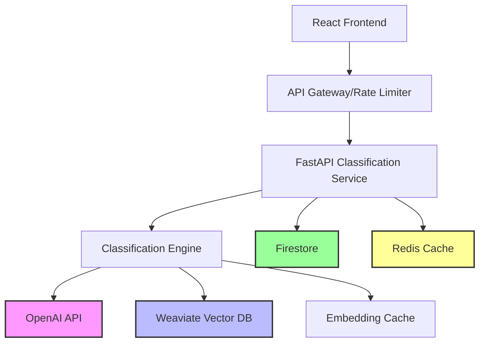

# Feature: Manufacturing Inquiry Classification

## 📋 Feature Overview

**Status**: 📝 Documentation  
**Priority**: 🔴 High  
**Sprint**: Sprint 1 - Core Features  
**Owner**: AI/ML Team & Backend Team  
**Created**: 2025-08-13  
**Target Completion**: 2025-08-20  

### Summary
An intelligent API endpoint that automatically classifies incoming manufacturing inquiries into predefined categories (Quote Request, Technical Specification, Capability Question, Partnership Inquiry) using LLM-based classification with confidence scoring. This enables automatic routing, prioritization, and response generation for manufacturing inquiries.

### Business Value
- **Problem**: Manual classification of inquiries is time-consuming and inconsistent
- **Solution**: AI-powered automatic classification with 95%+ accuracy
- **Impact**: Reduce response time by 50%, improve routing accuracy
- **Success Metrics**: Classification accuracy > 95%, Response time < 200ms, User satisfaction > 4.5/5

## 🎯 Requirements

### Functional Requirements
- [ ] Accept inquiry text (10-5000 characters) in English or Japanese
- [ ] Classify into one of 6 categories with confidence scoring
- [ ] Return all potential categories ranked by confidence (>0.1 threshold)
- [ ] Auto-detect language (EN/JP/other) using language detection
- [ ] Provide suggested routing actions based on classification
- [ ] Extract key terms/entities from inquiry text
- [ ] Support metadata enrichment (source, customer_id, priority)
- [ ] Maintain audit log of classifications for ML training
- [ ] Handle rate limiting (100 requests/minute per client)
- [ ] Implement fallback classification for model failures

### Non-Functional Requirements
- [ ] Performance: < 200ms p95 response time
- [ ] Scalability: Handle 1000 requests/minute globally
- [ ] Security: Firebase Auth with JWT validation required
- [ ] Accuracy: > 95% classification accuracy for common inquiries
- [ ] Availability: 99.9% uptime SLA
- [ ] Multi-language: Full support for EN/JP with 90%+ accuracy
- [ ] Cost optimization: Cache embeddings to reduce API calls by 50%
- [ ] Monitoring: OpenTelemetry instrumentation for all operations

### Out of Scope
- Batch processing of multiple inquiries (future enhancement)
- Custom category definition by users (v2.0)
- Real-time streaming classification
- Voice/audio inquiry processing
- Image/document attachment analysis
- Automated response generation (separate feature)
- Historical trend analysis
- A/B testing of classification models

## 📐 Technical Design

### Architecture Overview


### API Specification
**Location**: [`./api-spec.yaml`](./api-spec.yaml)

#### Endpoints Summary
| Method | Endpoint | Description | Auth Required |
|--------|----------|-------------|---------------|
| POST | `/api/v1/inquiries/classify` | Classify a manufacturing inquiry | Yes |
| GET | `/api/v1/inquiries/{id}` | Get classification result by ID | Yes |
| GET | `/api/v1/inquiries/stats` | Get classification statistics | Yes |

### Data Models
```typescript
interface ClassificationRequest {
  text: string;                    // 10-5000 characters
  metadata?: {
    source: 'web_form' | 'email' | 'chat' | 'phone' | 'api';
    customer_id?: string;
    timestamp?: string;
    priority?: 'low' | 'medium' | 'high' | 'urgent';
  };
}

interface ClassificationResponse {
  id: string;                      // UUID
  primary_category: CategoryType;   // Main classification
  confidence: number;               // 0-1 confidence score
  all_categories: Array<{
    category: CategoryType;
    confidence: number;
  }>;
  language: 'en' | 'ja' | 'other';
  suggested_actions?: string[];
  keywords?: string[];
  processing_time_ms: number;
  metadata: {
    model_version: string;
    processed_at: string;
    fallback_used?: boolean;
  };
}

type CategoryType = 
  | 'QUOTE_REQUEST'
  | 'TECHNICAL_SPECIFICATION'
  | 'CAPABILITY_QUESTION'
  | 'PARTNERSHIP_INQUIRY'
  | 'GENERAL_INQUIRY'
  | 'UNKNOWN';
```

### Database Schema
```typescript
// Firestore Collection: inquiries
interface InquiryDocument {
  id: string;                        // UUID
  text: string;                      // Original inquiry text
  language: 'en' | 'ja' | 'other';   // Detected language
  classification: {
    primary_category: CategoryType;
    confidence: number;
    all_categories: CategoryScore[];
    model_version: string;
  };
  metadata: {
    source: 'web_form' | 'email' | 'chat' | 'api';
    customer_id?: string;
    processed_at: Timestamp;
    processing_time_ms: number;
  };
  embeddings?: number[];             // Cached text embeddings
  keywords?: string[];               // Extracted keywords
  suggested_actions?: string[];      // Routing suggestions
  created_at: Timestamp;
  updated_at: Timestamp;
}

// Firestore Composite Indexes Required:
// 1. classification.primary_category + created_at DESC
// 2. metadata.customer_id + created_at DESC
// 3. language + classification.primary_category
```

## 🧪 Test Plan

**Location**: [`./test-plan.md`](./test-plan.md)

### Test Coverage Requirements
- Unit Tests: 95% coverage
- Integration Tests: All API endpoints
- E2E Tests: Critical user flows
- Performance Tests: Load and stress testing

### Test Status
- [ ] Unit tests written
- [ ] Integration tests written
- [ ] E2E tests written
- [ ] Performance tests completed
- [ ] Security scan passed

## 🔄 DDD/TDD Workflow Status

### Phase 1: Documentation ✅
- [x] Requirements gathered
- [x] API specification written
- [x] Data models defined
- [x] Architecture documented
- [x] Review completed

### Phase 2: Test Development 🔴
- [ ] Test plan created
- [ ] Unit tests written (failing)
- [ ] Integration tests written (failing)
- [ ] E2E tests written
- [ ] Tests reviewed

### Phase 3: Implementation ⏸️
- [ ] Backend service implemented
- [ ] Frontend components built
- [ ] All tests passing
- [ ] Code review completed
- [ ] Documentation updated

### Phase 4: Validation ⏸️
- [ ] Performance validated
- [ ] Security validated
- [ ] Accessibility validated
- [ ] User acceptance testing
- [ ] Production deployment

## 👥 User Stories

### Story 1: Sales Team Routes Quote Request
**As a** sales team member  
**I want to** automatically identify and route quote requests  
**So that** I can respond quickly with accurate pricing  

**Acceptance Criteria**:
- [ ] Quote requests identified with >90% confidence
- [ ] Customer details extracted and enriched
- [ ] Suggested response template generated
- [ ] Routed to correct sales queue within 1 minute
- [ ] Priority flag set based on inquiry content

### Story 2: Engineer Reviews Technical Specifications
**As an** engineering team member  
**I want to** quickly identify technical specification inquiries  
**So that** I can assess manufacturing feasibility  

**Acceptance Criteria**:
- [ ] Technical specs classified with >85% confidence
- [ ] Key specifications extracted (tolerances, materials, quantities)
- [ ] Similar past inquiries retrieved for reference
- [ ] Complexity score assigned for time estimation
- [ ] Auto-assigned to engineer with relevant expertise

### Story 3: Support Team Handles General Inquiries
**As a** customer support representative  
**I want to** identify general and capability questions  
**So that** I can provide accurate information quickly  

**Acceptance Criteria**:
- [ ] General inquiries classified correctly
- [ ] FAQ suggestions provided based on content
- [ ] Language detected for appropriate response
- [ ] Escalation path identified for complex questions
- [ ] Response time tracked for SLA compliance

## 🎨 UI/UX Design

### Mockups
- [Link to Figma/design tool]
- [Screenshots if available]

### User Flow
1. Customer submits inquiry via web form/email/API
2. System receives and validates inquiry text
3. Classification service processes inquiry:
   - Detects language
   - Extracts key terms
   - Classifies into categories
   - Calculates confidence scores
4. System routes inquiry based on classification:
   - QUOTE_REQUEST → Sales team queue
   - TECHNICAL_SPECIFICATION → Engineering review
   - CAPABILITY_QUESTION → Support team
   - PARTNERSHIP_INQUIRY → Business development
5. Assigned team receives notification with context
6. System logs classification for ML training

### Component Structure
```
InquiryClassification/
├── components/
│   ├── InquiryForm.tsx           # Inquiry submission form
│   ├── ClassificationResult.tsx   # Display classification results
│   ├── ConfidenceScore.tsx       # Visual confidence indicator
│   ├── CategoryBadge.tsx         # Category display component
│   └── RoutingSuggestion.tsx     # Routing recommendations
├── hooks/
│   ├── useClassification.ts      # Classification API hook
│   └── useInquiryHistory.ts      # Historical data hook
└── utils/
    ├── validators.ts              # Input validation
    └── formatters.ts              # Data formatting
```

## 🚀 Implementation Notes

### Dependencies
- External libraries: [List any new dependencies]
- Services: [List service dependencies]
- APIs: [List API dependencies]

### Configuration
```yaml
feature:
  enabled: true
  rateLimit: 100
  timeout: 30s
```

### Environment Variables
```bash
FEATURE_API_KEY=xxx
FEATURE_ENDPOINT=https://api.example.com
FEATURE_ENABLED=true
```

### Migration Strategy
[If replacing existing functionality, describe migration plan]

## 📊 Monitoring & Analytics

### Key Metrics
- Usage rate
- Error rate
- Response time (p50, p95, p99)
- User satisfaction score

### Logging
- Info: Feature usage
- Warning: Validation failures
- Error: Processing failures

### Alerts
- Error rate > 1%
- Response time > 200ms p95
- Service unavailable

## 🔒 Security Considerations

### Authentication/Authorization
- Firebase Auth JWT required for all endpoints
- Role-based access: 'user', 'admin', 'api_client'
- API key rotation every 90 days
- Service accounts for system-to-system calls

### Data Privacy
- PII masking in logs (customer_id, email, phone)
- 30-day retention for inquiry text
- Indefinite retention for classifications (anonymized)
- GDPR compliance for EU customers
- Encryption at rest (Firestore) and in transit (TLS 1.3)

### Vulnerability Assessment
- [ ] Input validation: 10-5000 char limit, UTF-8 only
- [ ] Prompt injection prevention: Input sanitization
- [ ] Rate limiting: 100 req/min per client
- [ ] DDoS protection: Cloud Armor rules
- [ ] API key security: Environment variables only
- [ ] CORS configuration: Allowed origins list
- [ ] Content Security Policy headers
- [ ] Request size limits: 1MB max

## 📝 Documentation

### User Documentation
- [ ] User guide written
- [ ] API documentation updated
- [ ] FAQ updated

### Developer Documentation
- [ ] Code comments added
- [ ] README updated
- [ ] Architecture docs updated

## 🏁 Release Checklist

### Pre-Release
- [ ] All tests passing
- [ ] Code review approved
- [ ] Documentation complete
- [ ] Security review passed
- [ ] Performance validated

### Release
- [ ] Feature flag enabled
- [ ] Monitoring configured
- [ ] Rollback plan ready
- [ ] Stakeholders notified

### Post-Release
- [ ] Monitor metrics
- [ ] Gather feedback
- [ ] Address issues
- [ ] Document lessons learned

## 📚 References

- [Related ADR](../architecture/decisions/)
- [API Documentation](../api/)
- [Test Results](../test-results/)
- [Performance Reports](../performance/)

## 📅 Timeline

| Milestone | Target Date | Actual Date | Status |
|-----------|------------|-------------|--------|
| Documentation Complete | [Date] | [Date] | ✅ |
| Tests Written | [Date] | - | 🔴 |
| Implementation Complete | [Date] | - | ⏸️ |
| Testing Complete | [Date] | - | ⏸️ |
| Production Release | [Date] | - | ⏸️ |

## 🗣️ Communication

### Stakeholders
- Product Owner: [Name]
- Tech Lead: [Name]
- QA Lead: [Name]
- Users: [User groups affected]

### Updates
- Weekly status in sprint review
- Slack channel: #feature-development
- Documentation: This document

---

**Last Updated**: [Date]  
**Next Review**: [Date]