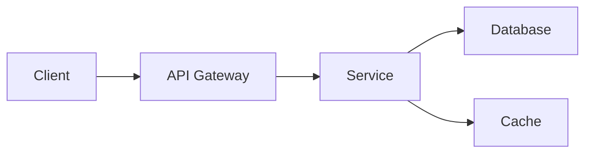

# Architecture Decision Record: [ADR-NUMBER] [Title]

**Date**: [YYYY-MM-DD]  
**Status**: [Proposed | Accepted | Deprecated | Superseded]  
**Deciders**: [List of people involved]  
**Technical Story**: [Ticket/Issue reference]  

## Context and Problem Statement

[Describe the context and problem that needs to be solved. What is the architectural decision that needs to be made? Why is it important?]

### Requirements
- **Functional**: [What must the solution do?]
- **Non-functional**: [Performance, scalability, security requirements]
- **Constraints**: [Technical, business, or regulatory constraints]

## Decision Drivers

- [Driver 1: e.g., Performance requirement < 200ms]
- [Driver 2: e.g., Must integrate with existing Firestore database]
- [Driver 3: e.g., Development team expertise in React/FastAPI]
- [Driver 4: e.g., Cost constraints for cloud services]

## Considered Options

### Option 1: [Option Name]
**Description**: [Brief description of the approach]

**Pros**:
- ✅ [Advantage 1]
- ✅ [Advantage 2]

**Cons**:
- ❌ [Disadvantage 1]
- ❌ [Disadvantage 2]

**Cost Estimate**: [Development time, operational cost]

### Option 2: [Option Name]
**Description**: [Brief description of the approach]

**Pros**:
- ✅ [Advantage 1]
- ✅ [Advantage 2]

**Cons**:
- ❌ [Disadvantage 1]
- ❌ [Disadvantage 2]

**Cost Estimate**: [Development time, operational cost]

### Option 3: [Option Name]
[Similar structure as above]

## Decision Outcome

**Chosen Option**: Option [N] - [Option Name]

### Rationale
[Explain why this option was selected over the others. Reference the decision drivers and how this option best addresses them.]

### Implementation Plan
1. [Step 1: e.g., Create API specification]
2. [Step 2: e.g., Write integration tests]
3. [Step 3: e.g., Implement service]
4. [Step 4: e.g., Deploy to staging]
5. [Step 5: e.g., Monitor and optimize]

## Consequences

### Positive
- ✅ [Good consequence 1]
- ✅ [Good consequence 2]
- ✅ [Good consequence 3]

### Negative
- ⚠️ [Negative consequence 1 and mitigation]
- ⚠️ [Negative consequence 2 and mitigation]

### Neutral
- ℹ️ [Neutral consequence 1]
- ℹ️ [Neutral consequence 2]

## Technical Details

### Architecture Diagram


### Code Example
```python
# Example implementation pattern
class ServiceImplementation:
    def __init__(self, db, cache):
        self.db = db
        self.cache = cache
    
    async def process(self, request):
        # Implementation following the decision
        pass
```

### Configuration
```yaml
# Example configuration
service:
  option: chosen_value
  performance:
    timeout: 30s
    max_connections: 100
```

## Validation

### Success Metrics
- [ ] [Metric 1: e.g., Response time < 200ms p95]
- [ ] [Metric 2: e.g., Error rate < 1%]
- [ ] [Metric 3: e.g., Cost within budget]

### Testing Strategy
- **Unit Tests**: [Coverage requirements]
- **Integration Tests**: [What to validate]
- **Performance Tests**: [Load requirements]
- **Security Tests**: [Security validations]

### Monitoring
- [What metrics to track]
- [Alert thresholds]
- [Dashboard requirements]

## Risks and Mitigations

| Risk | Probability | Impact | Mitigation |
|------|------------|--------|------------|
| [Risk 1] | High/Med/Low | High/Med/Low | [Mitigation strategy] |
| [Risk 2] | High/Med/Low | High/Med/Low | [Mitigation strategy] |

## Related Decisions

- [ADR-XXX]: [Related decision title]
- [ADR-YYY]: [Related decision title]

## References

- [Link to relevant documentation]
- [Link to proof of concept]
- [Link to benchmark results]
- [Link to similar implementations]

## Notes

[Any additional notes, assumptions, or clarifications]

---

## Review and Approval

| Reviewer | Role | Date | Status |
|----------|------|------|--------|
| [Name] | Tech Lead | [Date] | ⏳ Pending |
| [Name] | Security | [Date] | ⏳ Pending |
| [Name] | DevOps | [Date] | ⏳ Pending |

## Revision History

| Version | Date | Author | Changes |
|---------|------|--------|---------|
| 1.0 | [Date] | [Author] | Initial draft |
| 1.1 | [Date] | [Author] | [Changes made] |