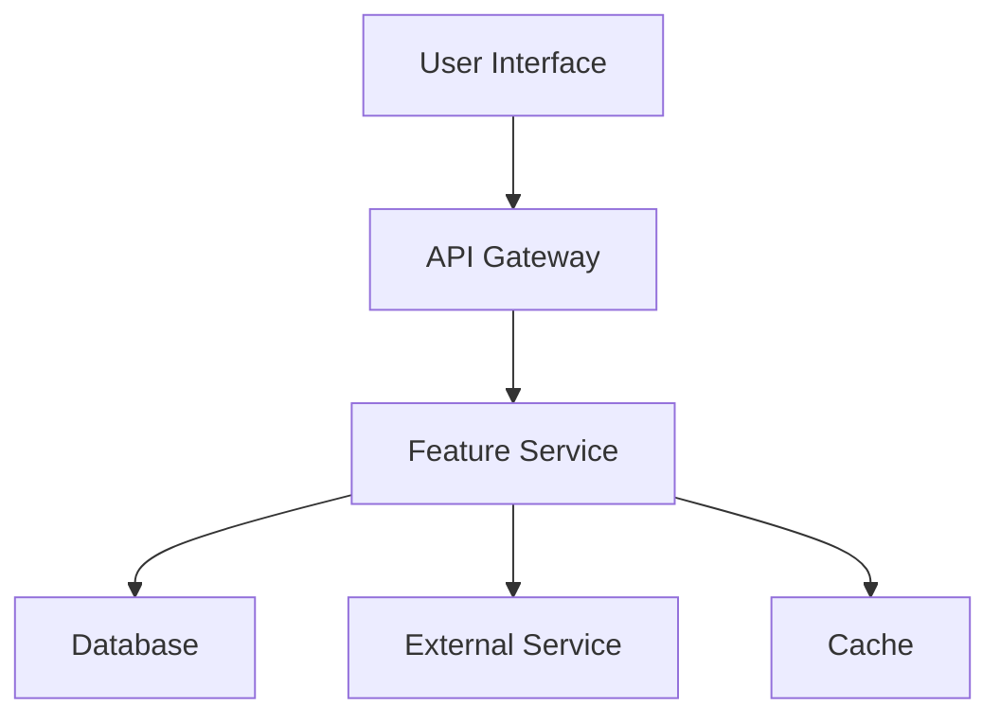

# Feature: [Feature Name]

## 📋 Feature Overview

**Status**: 📝 Documentation | 🧪 Testing | 🔨 Implementation | ✅ Complete  
**Priority**: 🔴 High | 🟡 Medium | 🟢 Low  
**Sprint**: [Sprint number/name]  
**Owner**: [Team/Person responsible]  
**Created**: [Date]  
**Target Completion**: [Date]  

### Summary
[One paragraph description of the feature and its value proposition]

### Business Value
- **Problem**: [What problem does this solve?]
- **Solution**: [How does this feature solve it?]
- **Impact**: [Expected business impact]
- **Success Metrics**: [How will we measure success?]

## 🎯 Requirements

### Functional Requirements
- [ ] [Requirement 1]
- [ ] [Requirement 2]
- [ ] [Requirement 3]

### Non-Functional Requirements
- [ ] Performance: [e.g., < 200ms response time]
- [ ] Scalability: [e.g., Handle 1000 concurrent users]
- [ ] Security: [e.g., Firebase Auth required]
- [ ] Accessibility: [e.g., WCAG 2.1 AA compliant]

### Out of Scope
- [What this feature will NOT do]
- [Future enhancements not included]

## 📐 Technical Design

### Architecture Overview


### API Specification
**Location**: [`./api-spec.yaml`](./api-spec.yaml)

#### Endpoints Summary
| Method | Endpoint | Description | Auth Required |
|--------|----------|-------------|---------------|
| POST | `/api/v1/[feature]` | [Description] | Yes |
| GET | `/api/v1/[feature]/{id}` | [Description] | Yes |

### Data Models
```typescript
interface FeatureRequest {
  field1: string;
  field2: number;
  field3?: string;
}

interface FeatureResponse {
  id: string;
  status: 'pending' | 'completed' | 'failed';
  result: any;
  createdAt: Date;
}
```

### Database Schema
```typescript
// Firestore Collection: features
{
  id: string;           // Document ID
  userId: string;       // Owner reference
  data: object;         // Feature data
  status: string;       // Processing status
  createdAt: Timestamp; // Creation time
  updatedAt: Timestamp; // Last update
}
```

## 🧪 Test Plan

**Location**: [`./test-plan.md`](./test-plan.md)

### Test Coverage Requirements
- Unit Tests: 95% coverage
- Integration Tests: All API endpoints
- E2E Tests: Critical user flows
- Performance Tests: Load and stress testing

### Test Status
- [ ] Unit tests written
- [ ] Integration tests written
- [ ] E2E tests written
- [ ] Performance tests completed
- [ ] Security scan passed

## 🔄 DDD/TDD Workflow Status

### Phase 1: Documentation ✅
- [x] Requirements gathered
- [x] API specification written
- [x] Data models defined
- [x] Architecture documented
- [x] Review completed

### Phase 2: Test Development 🔴
- [ ] Test plan created
- [ ] Unit tests written (failing)
- [ ] Integration tests written (failing)
- [ ] E2E tests written
- [ ] Tests reviewed

### Phase 3: Implementation ⏸️
- [ ] Backend service implemented
- [ ] Frontend components built
- [ ] All tests passing
- [ ] Code review completed
- [ ] Documentation updated

### Phase 4: Validation ⏸️
- [ ] Performance validated
- [ ] Security validated
- [ ] Accessibility validated
- [ ] User acceptance testing
- [ ] Production deployment

## 👥 User Stories

### Story 1: [User Story Title]
**As a** [user type]  
**I want to** [action]  
**So that** [benefit]  

**Acceptance Criteria**:
- [ ] [Criterion 1]
- [ ] [Criterion 2]
- [ ] [Criterion 3]

### Story 2: [User Story Title]
[Similar structure]

## 🎨 UI/UX Design

### Mockups
- [Link to Figma/design tool]
- [Screenshots if available]

### User Flow
1. User navigates to [page]
2. User performs [action]
3. System responds with [result]
4. User sees [outcome]

### Component Structure
```
FeatureComponent/
├── FeatureContainer.tsx    # Main container
├── FeatureForm.tsx         # Input form
├── FeatureList.tsx         # Results display
├── FeatureItem.tsx         # Individual item
└── hooks/
    └── useFeature.ts       # Custom hook
```

## 🚀 Implementation Notes

### Dependencies
- External libraries: [List any new dependencies]
- Services: [List service dependencies]
- APIs: [List API dependencies]

### Configuration
```yaml
feature:
  enabled: true
  rateLimit: 100
  timeout: 30s
```

### Environment Variables
```bash
FEATURE_API_KEY=xxx
FEATURE_ENDPOINT=https://api.example.com
FEATURE_ENABLED=true
```

### Migration Strategy
[If replacing existing functionality, describe migration plan]

## 📊 Monitoring & Analytics

### Key Metrics
- Usage rate
- Error rate
- Response time (p50, p95, p99)
- User satisfaction score

### Logging
- Info: Feature usage
- Warning: Validation failures
- Error: Processing failures

### Alerts
- Error rate > 1%
- Response time > 200ms p95
- Service unavailable

## 🔒 Security Considerations

### Authentication/Authorization
- [Authentication requirements]
- [Authorization rules]
- [Role-based access]

### Data Privacy
- [PII handling]
- [Data retention policy]
- [Encryption requirements]

### Vulnerability Assessment
- [ ] Input validation implemented
- [ ] SQL injection prevention
- [ ] XSS prevention
- [ ] CSRF protection
- [ ] Rate limiting configured

## 📝 Documentation

### User Documentation
- [ ] User guide written
- [ ] API documentation updated
- [ ] FAQ updated

### Developer Documentation
- [ ] Code comments added
- [ ] README updated
- [ ] Architecture docs updated

## 🏁 Release Checklist

### Pre-Release
- [ ] All tests passing
- [ ] Code review approved
- [ ] Documentation complete
- [ ] Security review passed
- [ ] Performance validated

### Release
- [ ] Feature flag enabled
- [ ] Monitoring configured
- [ ] Rollback plan ready
- [ ] Stakeholders notified

### Post-Release
- [ ] Monitor metrics
- [ ] Gather feedback
- [ ] Address issues
- [ ] Document lessons learned

## 📚 References

- [Related ADR](../architecture/decisions/)
- [API Documentation](../api/)
- [Test Results](../test-results/)
- [Performance Reports](../performance/)

## 📅 Timeline

| Milestone | Target Date | Actual Date | Status |
|-----------|------------|-------------|--------|
| Documentation Complete | [Date] | [Date] | ✅ |
| Tests Written | [Date] | - | 🔴 |
| Implementation Complete | [Date] | - | ⏸️ |
| Testing Complete | [Date] | - | ⏸️ |
| Production Release | [Date] | - | ⏸️ |

## 🗣️ Communication

### Stakeholders
- Product Owner: [Name]
- Tech Lead: [Name]
- QA Lead: [Name]
- Users: [User groups affected]

### Updates
- Weekly status in sprint review
- Slack channel: #feature-development
- Documentation: This document

---

**Last Updated**: [Date]  
**Next Review**: [Date]